Front-end
=========

[Revenir à la documentation](index.md)

# Sommaire
* [Pré-compilateur, pattern & coding style](#pré-compilateur-pattern--coding-style)
* [Base](#base)
    * [Container](#container)
    * [Grid](#grid)
    * [Flexbox](#flexbox)
* [Composants](#composants)
    * [Alert](#alert)
    * [Button](#button)
    * [Card](#card)

# Pré-compilateur, pattern & coding style
* [SASS](https://sass-lang.com/documentation)
* [Pattern 7.1](https://sass-guidelin.es/#the-7-1-pattern)
* [BEM](http://getbem.com/introduction/)

# Base

## Container
Pour la gestion du conteneur, je me suis basé sur Bootstrap.
| .Container        | **Extra-small** <576px | **Small** ≥576px | **Medium** ≥768px | **Large** ≥992px | **Extra-large** ≥1200px |
|-------------------|------------------------|------------------|-------------------|------------------|-------------------------|
|                   | 100%                   | 540px            | 720px             | 960px            | 1140px                  |
| .Container--sm    | 100%                   | 540px            | 720px             | 960px            | 1140px                  |
| .Container--md    | 100%                   | 100%             | 720px             | 960px            | 1140px                  |
| .Container--lg    | 100%                   | 100%             | 100%              | 960px            | 1140px                  |
| .Container--xl    | 100%                   | 100%             | 100%              | 100%             | 1140px                  |
| .Container--fluid | 100%                   | 100%             | 100%              | 100%             | 100%                    |

## Grid
On garde les même et on recommence, je me suis basé sur la grille de Bootstrap. On est donc sur une base de 12 colonnes, avec la gestion du responsive.
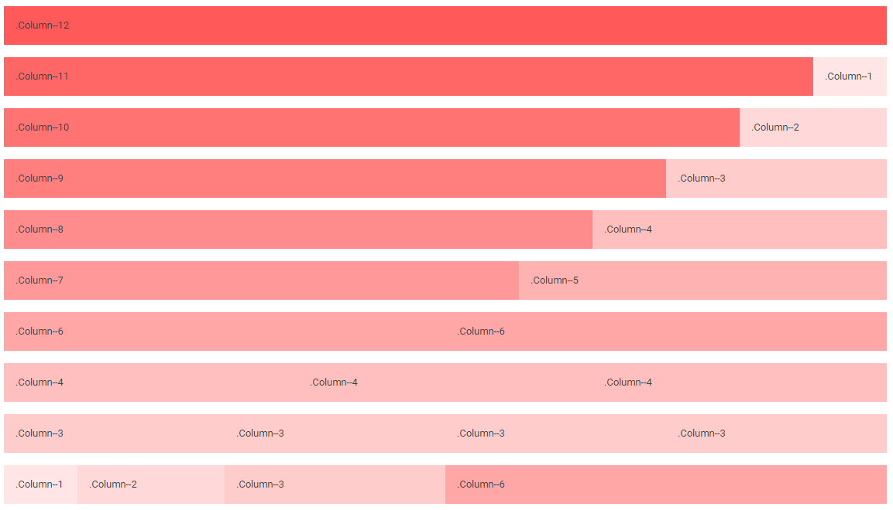

### Responsive
```html
<div class="Container">
    <div class="Row">
        <div class="Column Column--12 Column--sm-10 Column--md-8 Column--lg-6 Column--xl-4"></div>
        <div class="Column Column--12 Column--sm-2 Column--md-4 Column--lg-6 Column--xl-8"></div>
    </div>
</div>
```
**Ecran extra-large :**

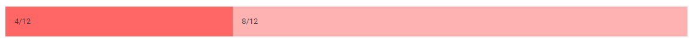

**Ecran large :**

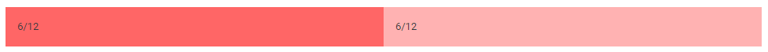

**Ecran medium :**

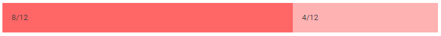

**Ecran small :**

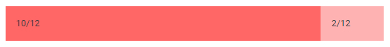

**Ecran extra-small :**

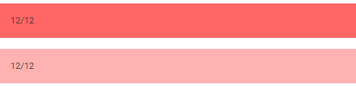

## Flexbox
**Mise en place de flexbox :**
```html
<div class="Flex"></div>
```

**Déterminer la direction :**
```html
<div class="Flex Flex--column"></div>
```

**Gérer l'alignement sur l'axe principal :**
```html
<div class="Justify--center"></div>
```
Alignements :
* `Justify--start`: `flex-start`
* `Justify--end`: `flex-end`
* `Justify--center`: `center`
* `Justify--between`: `space-between`
* `Justify--around`: `space-around`
* `Justify--evenly`: `space-evenly`

**Gérer l'alignement sur l'axe secondaire :**
```html
<div class="Align--center"></div>
```
Alignements :
* `Align--start`: `flex-start`
* `Align--end`: `flex-end`
* `Align--center`: `center`
* `Align--stretch`: `stretch`
* `Align--baseline`: `baseline`

## Textes
### Tailles de texte
Texte de petite taille :
```html
<span class="Text Text--small"></span>
```

Texte de taille normal :
```html
<span class="Text Text--normal"></span>
```

### Couleurs de texte
Liste des couleurs :
* primary
* secondary
* white
* light
* muted
* grey
* dark
* black
* success
* info
* warning
* danger

Pour colorer un texte, on utilise par défaut la clase `Text` à laquelle on ajoute `Text--{COLOR}`, il suffit alors de remplacer `{COLOR}` par l'une des couleurs.

Exemple :
```html
<span class="Text Text--primary"></span>
```

### Titres
Il suffit d'utiliser la classe `Heading` ainsi que le **modifier** pour gérer la taille du titre.
Exemple :
```html
<h1 class="Heading Heading--1"></h1>
```

Tailles :
* `1` : `2.5rem`
* `2` : `2rem`
* `3` : `1.75rem`
* `4` : `1.5rem`
* `5` : `1.25rem`
* `6` : `1rem`

# Composants

## Alert

### Icône
En plus de la classe `Alert`, il faut ajouter le **modifier** `Alert--icon` pour préciser qu'il contiendra un icône, puis préciser l'icône `Alert--icon-{TYPE}-{ICON}`.

On gère l'icône avec la police **font awesome**, en précisant le type de police **solid** ou **regular**, ainsi que le nom de l'icône.
Exemples : `Alert--icon-solid-user` ou `Alert--icon--regular-user`.

**Demo :**
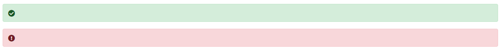
```html
<div class="Alert Alert--success Alert--icon Alert--icon-solid-check-circle" role="alert"></div>
<div class="Alert Alert--danger Alert--icon Alert--icon-solid-exclamation-circle" role="alert"></div>
```

### Couleurs
En plus de la classe `Alert`, il faut ajouter un **modifier** pour gérer la couleur, exemple `Alert--success`.

#### Primary

```html
<div class="Alert Alert--primary" role="alert"></div>
```
#### Secondary
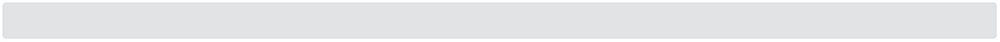
```html
<div class="Alert Alert--secondary" role="alert"></div>
```
#### Light

```html
<div class="Alert Alert--light" role="alert"></div>
```
#### Dark
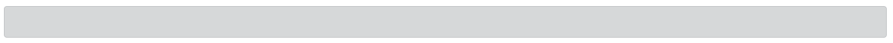
```html
<div class="Alert Alert--dark" role="alert"></div>
```
#### Success
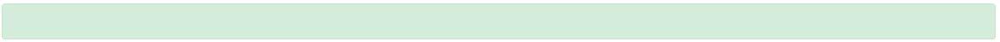
```html
<div class="Alert Alert--success" role="alert"></div>
```
#### Info
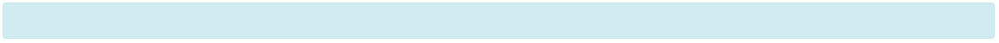
```html
<div class="Alert Alert--info" role="alert"></div>
```
#### Warning
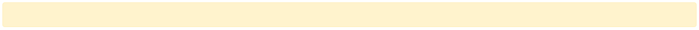
```html
<div class="Alert Alert--warning" role="alert"></div>
```
#### Danger
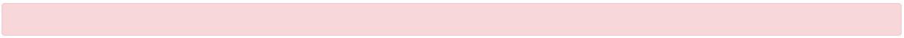
```html
<div class="Alert Alert--danger" role="alert"></div>
```

## Button

### Icône
En plus de la classe `Button`, il faut ajouter le **modifier** `Button--icon` pour préciser qu'il contiendra un icône, puis préciser l'icône `Button--icon-{TYPE}-{ICON}`.

On gère l'icône avec la police **font awesome**, en précisant le type de police **solid** ou **regular**, ainsi que le nom de l'icône.
Exemples : `Button--icon-solid-user` ou `Button--icon--regular-user`.

**Demo :**

```html
<button class="Button Button--primary Button--icon Button--icon-solid-user">Icônes</button>
```
### Tailles
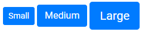
```html
<button class="Button Button--primary Button--small">Small</button>
<button class="Button Button--primary Button--medium">Medium</button>
<button class="Button Button--primary Button--large">Large</button>
```
### Outline
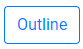
```html
<button class="Button Button--primary Button--outline">Outline</button>
```
### Couleurs
#### Primary
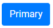
```html
<button class="Button Button--primary">Primary</button>
```
#### Secondary
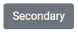
```html
<button class="Button Button--secondary">Secondary</button>
```
#### Light
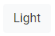
```html
<button class="Button Button--light">Light</button>
```
#### Dark
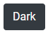
```html
<button class="Button Button">Dark</button>
```
#### Success

```html
<button class="Button Button--success">Success</button>
```
#### Info

```html
<button class="Button Button--info">Info</button>
```
#### Warning

```html
<button class="Button Button--warning">Warning</button>
```
#### Danger
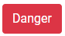
```html
<button class="Button Button--danger">Danger</button>
```

## Card

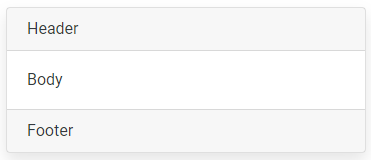
```html
<div class="Card">
    <div class="Card__Header">Header</div>
    <div class="Card__Body">Body</div>
    <div class="Card__Footer">Footer</div>
</div>
```
### Couleurs
#### Primary

```html
<div class="Card Card--primary">
    <div class="Card__Header">Header</div>
    <div class="Card__Body">Body</div>
    <div class="Card__Footer">Footer</div>
</div>
```
#### Secondary
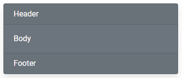
```html
<div class="Card Card--secondary">
    <div class="Card__Header">Header</div>
    <div class="Card__Body">Body</div>
    <div class="Card__Footer">Footer</div>
</div>
```
#### Light
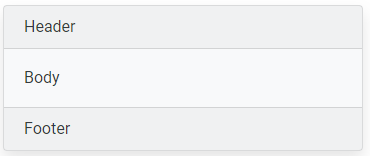
```html
<div class="Card Card--light">
    <div class="Card__Header">Header</div>
    <div class="Card__Body">Body</div>
    <div class="Card__Footer">Footer</div>
</div>
```
#### Dark
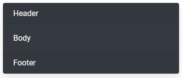
```html
<div class="Card Card--dark">
    <div class="Card__Header">Header</div>
    <div class="Card__Body">Body</div>
    <div class="Card__Footer">Footer</div>
</div>
```
#### Success
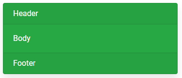
```html
<div class="Card Card--success">
    <div class="Card__Header">Header</div>
    <div class="Card__Body">Body</div>
    <div class="Card__Footer">Footer</div>
</div>
```
#### Info
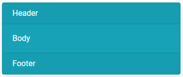
```html
<div class="Card Card--info">
    <div class="Card__Header">Header</div>
    <div class="Card__Body">Body</div>
    <div class="Card__Footer">Footer</div>
</div>
```
#### Warning
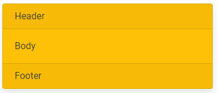
```html
<div class="Card Card--warning">
    <div class="Card__Header">Header</div>
    <div class="Card__Body">Body</div>
    <div class="Card__Footer">Footer</div>
</div>
```
#### Danger
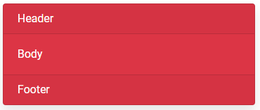
```html
<div class="Card Card--danger">
    <div class="Card__Header">Header</div>
    <div class="Card__Body">Body</div>
    <div class="Card__Footer">Footer</div>
</div>
```
