DOCUMENTATION
=============

# Sommaire
* [Installation](#installation)
* [Clean Architecture](#clean-architecture)
* [Test Driven Development](#test-driven-development)
* [Tests](#tests)
* [Sitemap](#sitemap)
* [Cas d'utilisation](#cas-dutilisation)
    * [Liste des cas d'utilisation](#liste-des-cas-dutilisation)
        * [Inscription](#inscription)
        * [Authentification](#authentification)
        * [Déconnexion](#déconnexion)
        * [Modifier son profil](#modifier-son-profil)
        * [Modifier son mot de passe](#modifier-son-mot-de-passe)
        * [Répondre à un quiz](#répondre-à-un-quiz)
        * [Classement](#classement)
        * [Dashboard](#dashboard)
        * [Gestion des questions](#gestion-des-questions)
        * [Gestion des utilisateurs](#gestion-des-utilisateurs)
    * [Générer un cas d'utilisation](#générer-un-cas-dutilisation)
* [Front-end](front.md)

# Installation

**Pré-requis** :
* PHP >= 7.4.0
* [Symfony (binaire)](https://symfony.com/download)

***Facultatif** :
* [ChromeDriver](https://sites.google.com/a/chromium.org/chromedriver/)

Clonez le repository :
```
git clone https://github.com/TBoileau/code-challenge
```

Installez les dépendances :
```
composer install
```

# Clean Architecture
Un schéma vaut mieux qu'un long discours :
[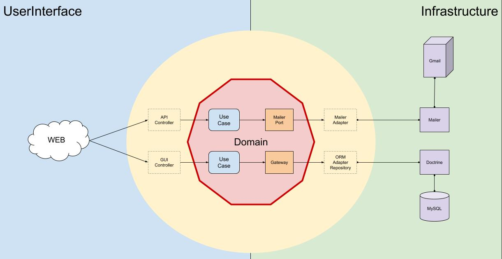](img/clean_architecture.jpg)

L'essentiel à retenir :
- L'interface (UI) pilote le domaine
- Le domaine pilote l'infrastructure
- La requête HTTP arrive dans ton contrôleur, qui appelle le cas d'utilisation
- Le cas d'utilisation va utiliser un ou plusieurs ports (si besoin) pour effectuer un traitement 
- Un port est une interface
- Grace à l'[inversion de dépendance](https://github.com/errorname/clean-code-php#principe-dinversion-des-d%C3%A9pendances) vous n'avez pas à vous soucier de l'implémentation de l'adapter puisque vous ne dépendez que de son abstraction (le port, qui est une interface)

Un autre schéma pour détailler les différentes classes qui interviennent lorsqu'un utilisateur envoie une requête au serveur.

Imaginons le contexte suivant : *Je souhaite afficher le contenu demon article, pour cela je vais sur la page /blog/slug-de-mon-article*.

[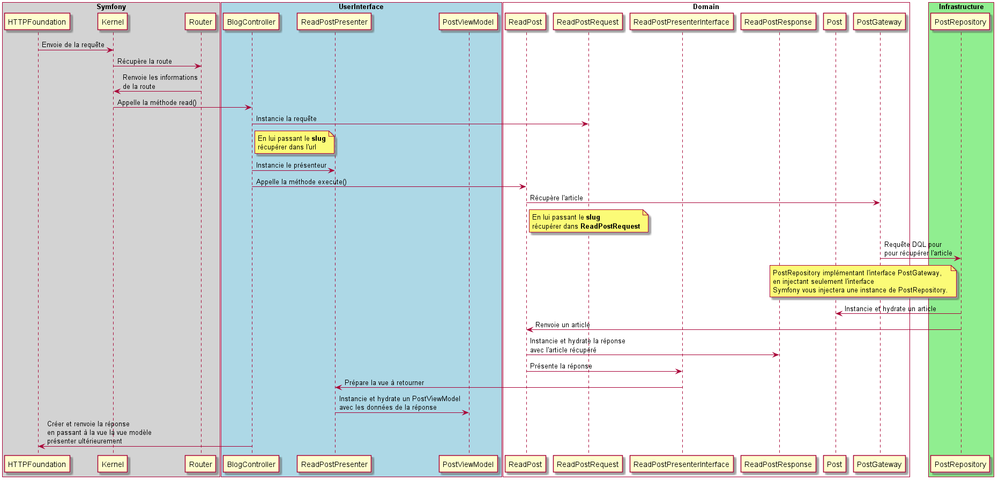](img/request.png)

# Test Driven Development
Cette pratique de développement a plusieurs objectifs :
- Mener le développement d'une fonctionnalité grace au test
- Faciliter l'implémentation et le refactoring de la fonctionnalité
- Tester son code

Mettre **tester son code** en dernier est intentionnel. En effet, le but premier de la TDD n'est pas de tester son code. 

Vous avez sans doute lu quelque part que la TDD est une méthode qui engage le développeur à implémenter le test avec sa fonctionnalité. Ce n'est de la TDD, cela s'appelle la méthode **test first**. Cependant TDD intégre cette méthode mais n'est qu'un outil pour mener son développement à terme, facilement, rapidement et sereinement.

Voyons ensemble les étapes pour la mise en place de la TDD :
* J'implémente mon test avec une assertion très simple
* Je lance mon test, le résultat doit être **rouge**
* J'implémente le minimum de code pour passer mon test au **vert**
* Je modifie mon test en ajoutant une nouvelle assertion
* Je lance mon test, le résultat doit être **rouge**
* Je modifie mon code pour passer le test au **vert**
* J'effectue une petite session de refactoring
* Mon test doit être au **vert** et ainsi s'assurer que mon refactoring est fonctionnel

Je vous invite à regarder cet [exemple](tdd.md).


# Tests
Tout d'abord, faisons le point sur les différentes types de tests que nous implémenterons.

Pour cela, nous allons suivre la pyramide de test :
* **Test unitaire** : Tester le domaine en **TDD**.
* **Test d'intégration** : Tester l'interface, en simulant une requête HTTP, en bouchonnant les ports secondaires.
* **Test système** : Tester l'interface, toujours en simulant une requête HTTP, sans bouchonner les ports secondaires.
* **Test de bout-en-bout** : Tester un scénario complet sans simuler de requête HTTP avec [Panther](https://github.com/symfony/panther).

Lancer tous les tests :
```
make tests
```

Lancer seulement les tests unitaires :
```
make unit-tests
```

Lancer seulement les tests d'intégration :
```
make integration-tests
```

Lancer seulement les tests systèmes :
```
make system-tests
```

Lancer seulement les tests bout-en-bout :
```
make e2e-tests
```

Si vous le souhaitez, lors de l'execution des tests de bout-en-bout, vous pouvez demander configurer votre environnement de test pour qu'un navigateur s'ouvre et effectue les actions implémentées dans votre test, tel un automate.

Pour cela, si ce n'est pas déjà fait, je vous invite à créer un fichier de configuration pour votre environnement de test `.env.test.local` :
```dotenv
PANTHER_NO_HEADLESS=1
PANTHER_WEB_SERVER_PORT=8001
```
Dans ce cas, vous précisez que vous ne souhaitez pas que **Panther** soit en `headless`, et donc que vous souhaitez vraiment avoir un navigateur **Chrome** qui s'ouvre pour effectuer les tests.

# Sitemap
[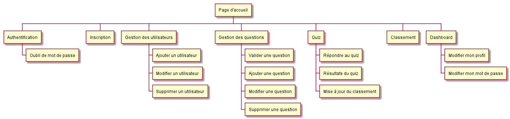](uml/sitemap.puml)

# Cas d'utilisation
Dans un premier temps, il est de bon ton de définir ce qu'est un cas d'utilisation. Pour faire simple, c'est une fonctionnalité, exemples :
* Répondre à un quiz
* S'inscrire
* Récupérer l'ensemble des statistiques d'un utilisateur

## Liste des cas d'utilisation
[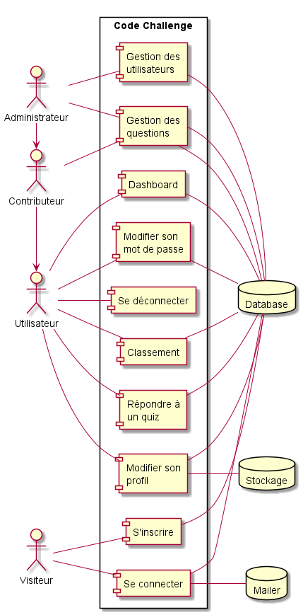](uml/packages.puml)

### Inscription
[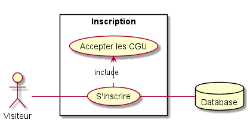](uml/registration.puml)

### Authentification
[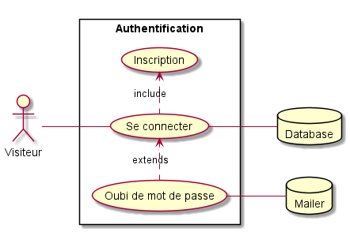](uml/authentication.puml)

### Déconnexion
[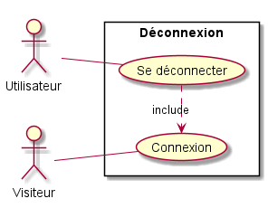](uml/sign_out.puml)

### Modifier son profil
[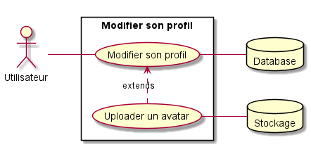](uml/update_profile.puml)

### Modifier son mot de passe
[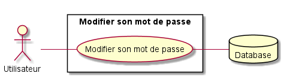](uml/update_password.puml)

### Répondre à un quiz
[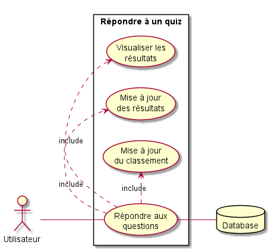](uml/reply_quiz.puml)

### Classement
[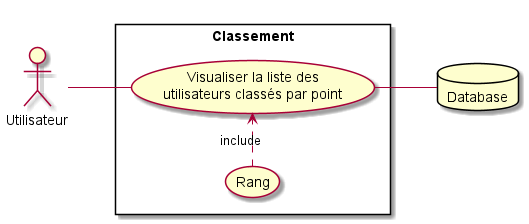](uml/ranking.puml)

### Dashboard
[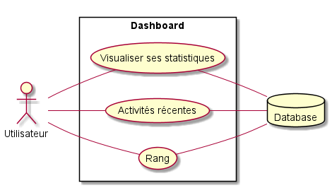](uml/dashboard.puml)

### Gestion des questions
[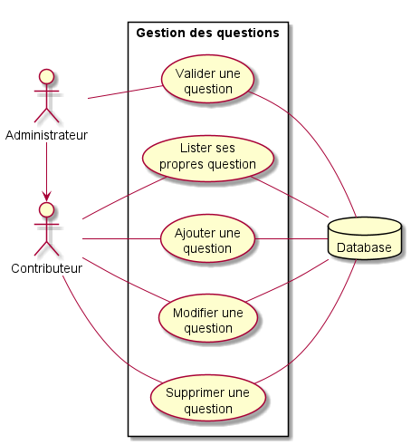](uml/manage_questions.puml)

### Gestion des utilisateurs
[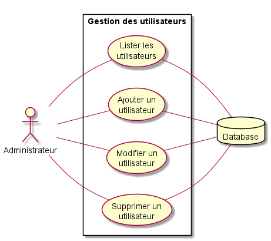](uml/manage_users.puml)


## Générer un cas d'utilisation
Pour vous faciliter la vie, j'ai implémenté un petit `Maker` pour générer tout ça : 
```
php bin/console make:user-case DomainName UseCaseName
```

Il ne vous reste plus qu'à remplacer les éléments suivants :
* `DomainName` : le nom de votre domaine, ou plus simplement le dossier dans lequel se trouvera votre cas d'utilisation.
* `UseCaseName` : le nom de votre cas d'utilisation.

*Note : Le nom du domaine et cas d'utilisation doivent en `upper camel case`, exemple : `php bin/console Quiz TakeQuiz`.*
